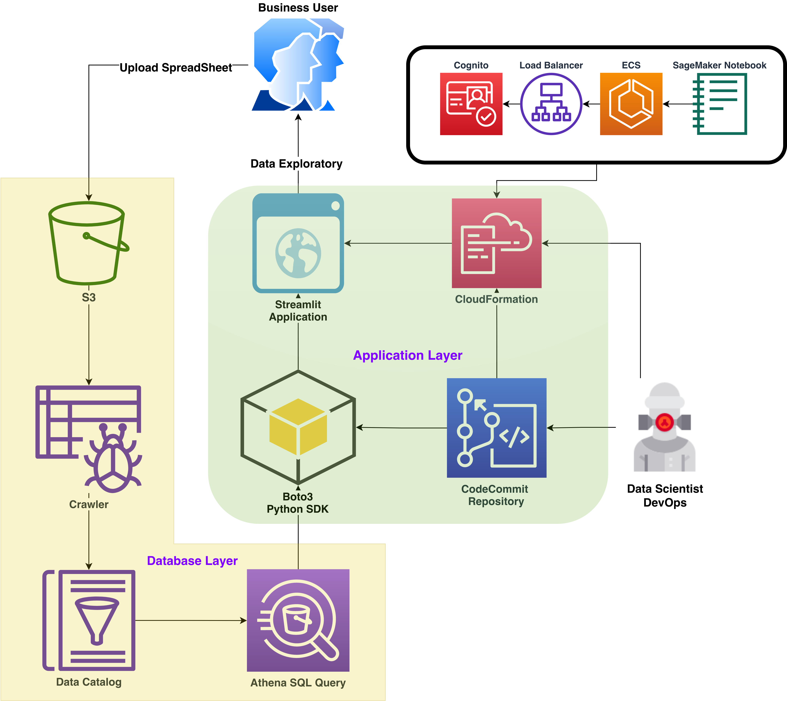
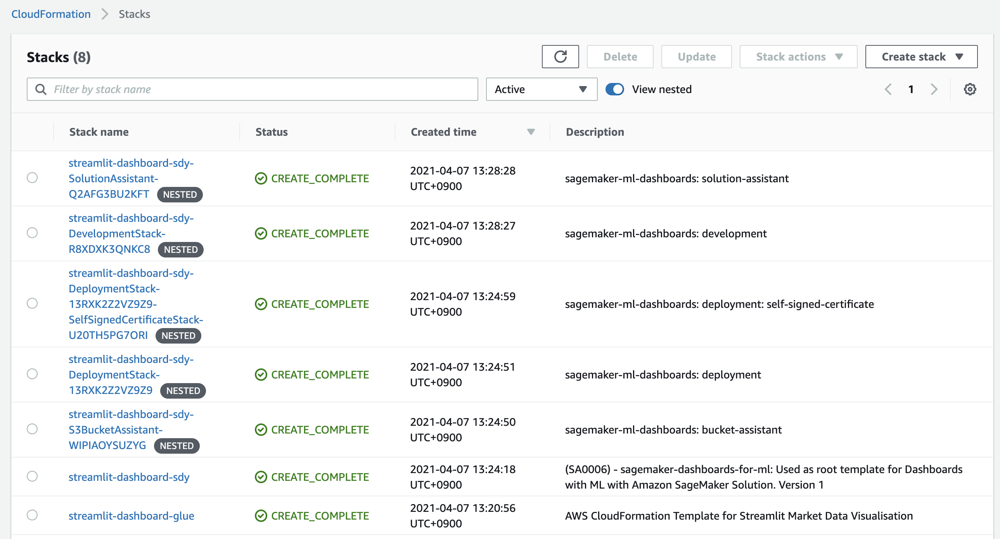
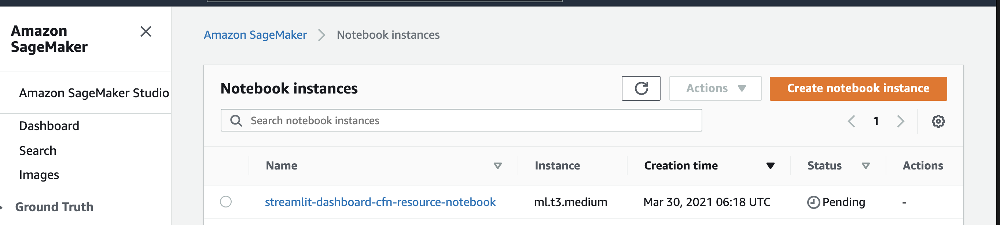
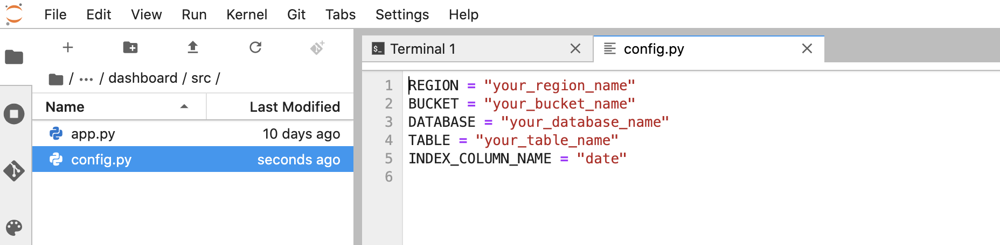
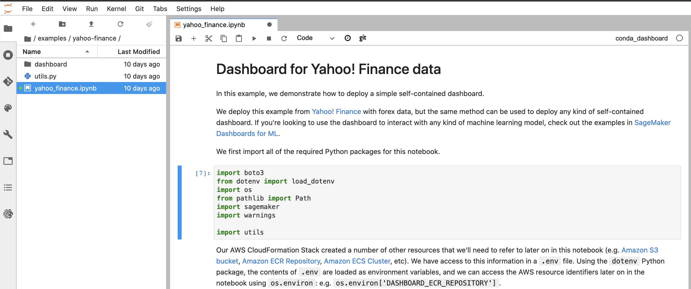
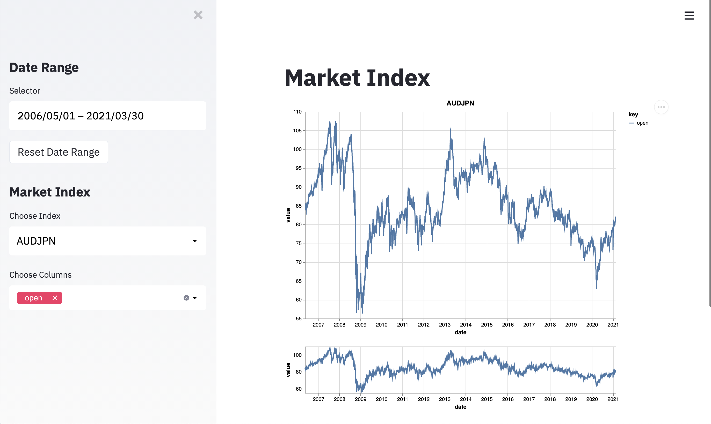
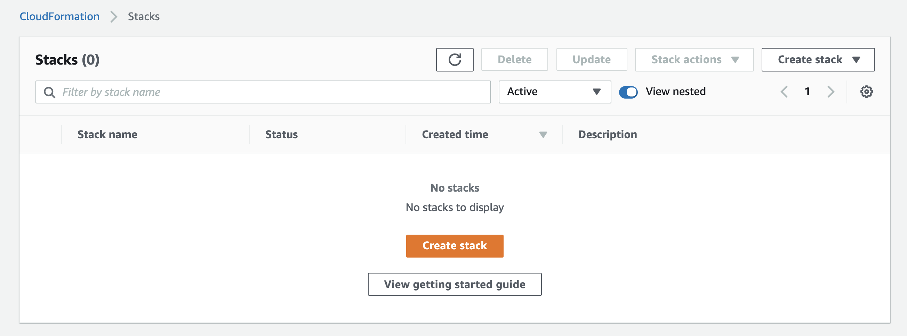

# 🎛️ Build An Interactive Dashboard for Exploratory Data Analysis using Streamlit and Deploy on AWS Cloud

## 💻 Installation and Local Running

```bash
pip install -r requirements.txt
streamlit run script/eda.py
```

## 🏗️ Development

Modify and update:

- `script/eda.py`
- `script/config.py`

## :notebook_with_decorative_cover: Summary

This blogpost will teach you how to standup an Exploratory Data Analysis EDA dashboard for business users using AWS services with [Streamlit](https://streamlit.io/). This EDA dashboard allows for quick end-to-end deployment with minimal effort and the ability to scale out the application and database layers as needed. The EDA dashboard serves insights in a secure and robust way without getting bogged down in time-consuming frontend development.



The database layer is backed by Amazon [S3](https://aws.amazon.com/s3/), [Amazon Glue](https://aws.amazon.com/glue/?nc2=type_a&whats-new-cards.sort-by=item.additionalFields.postDateTime&whats-new-cards.sort-order=desc), and [Amazon Athena](https://aws.amazon.com/athena/?nc2=type_a&whats-new-cards.sort-by=item.additionalFields.postDateTime&whats-new-cards.sort-order=desc). Business users can upload flat files into the S3 bucket, this then triggers an [Amazon Glue Crawler](https://docs.aws.amazon.com/glue/latest/dg/add-crawler.html) which loads the data into a database table for querying by Amazon Athena.

The application layer makes use of a combination of Streamlit, [Amazon Cognito](https://aws.amazon.com/cognito/?nc2=type_a), an [Application Load Balancer](https://docs.aws.amazon.com/elasticloadbalancing/latest/application/introduction.html) ALB, [Amazon Elastic Container Service](https://aws.amazon.com/ecs/?whats-new-cards.sort-by=item.additionalFields.postDateTime&whats-new-cards.sort-order=desc&ecs-blogs.sort-by=item.additionalFields.createdDate&ecs-blogs.sort-order=desc) ECS, and [Amazon SageMaker.](https://aws.amazon.com/sagemaker/) The Streamlit application is stood up via a SageMaker notebook and hosted on ECS behind an ALB. Business users then use Amazon Cognito to login and run queries against the Amazon Athena database, getting analytic results back visually from the dashboard.

### Getting Started

To get started, you will first need to install the required packages on your local machine or on an [Amazon Application Compute Cloud](https://aws.amazon.com/ec2/) (Amazon EC2) instance. To learn more, see [Getting Started with Amazon EC2](https://aws.amazon.com/ec2/getting-started/). If you are using your local machine, credentials must first be configured, as explained in this [documentation](https://docs.aws.amazon.com/sdk-for-java/v1/developer-guide/setup-credentials.html). In addition, make sure you have [Docker](https://www.docker.com/) and the [AWS Command Line Interface](https://aws.amazon.com/cli/) AWS CLI already installed. This tutorial assumes that you have an environment with the necessary [Identity Access Management IAM permissions](https://docs.aws.amazon.com/IAM/latest/UserGuide/getting-started.html).

First clone the Github repo into a local folder.

`git clone https://github.com/sunbc0120/streamlit-deployment-aws.git`

### Building Out the Infrastructure

In the cloned directory there should be a file called  `standup.sh`. We will next use this script to build out the application layer and database layer infrastructure. 

A quick preview of the first lines shows that the resource names are set here.
Specifically, the stack and sub-stack names along with the names for the S3 bucket where the data is stored, names for Glue, and the region that hosts the dashboard.

For this tutorial, you will leave these variables for resource names, including the default region, as they are. The resource names and region are changeable inside of the first few lines of the bash script as shown below:

```
#!/bin/bash
stack_name=streamlit-dashboard

# Using Default aws region
AWS_DEFAULT_REGION=$(aws configure list | grep region | awk '{print $2}')

# Variables set from the stack
S3_BUCKET_NAME=${stack_name}-$(uuidgen | cut -d '-' -f 1)
DATABASE_NAME=${stack_name}-blog-post
GLUE_CRAWLER_NAME=${stack_name}-glue-cralwer
TABLE_NAME=$(echo ${DATABASE_NAME} | tr - _)

# Coginto user paramater for first login
COGNITO_USER=XYZ@XYZ.com
...
```

With that in mind, first make sure that the Python dependencies are installed:

```python
python3 -m venv venv
source venv/bin/activate
pip install -r requirements.txt
```

Next, to kick off the Yahoo! Finance data pull and cloud infrastructure creation, run the following command:

`bash standup.sh`

This will start building the necessary resources in your default AWS account using the AWS CLI and Amazon CloudFormation templates. 

Specifically, this script will create:

1) An S3 bucket to hold the Yahoo! Finance forex data in
2) Run a Python job that downloads the Yahoo! Finance forex data and pushes it to S3
3) An Amazon Athena Database to query the data and an Amazon Glue Crawler to load the data into Athena
4) Packages the application layer into a single CloudFormation template and then deploys the resources for the application layer, including the SageMaker Notebook for standing up Streamlit

### More Details on Standing-up

Some considerations to note are that the Python script will download files temporarily into your local folder before loading them into S3. The python downloader script `./script/yahoo_idx.py` has parameters passed which are set for a specific date range and specific indexes. In this example, you will pull dates from May 2006 to February 2021 for the SP500, AX200 and certain currencies against the Australian Dollar.

```
start_dates = ["2006-05-16"] + start_dates
end_dates = end_dates + ["2021-02-18"]
# dict of the name for the output file and then query string for Yahoo Finance
tickers = {
    "SP500": "^GSPC",
    "AX200": "^AXJO",
    "AUDUSD": "AUDUSD=X",
    "AUDCNY": "AUDCNY=X",
    "AUDJPN": "AUDJPY=X",
    "AUDEUR": "AUDEUR=X",
}
```

In addition to requiring an S3 Bucket, Amazon Glue needs an Amazon Athena Workgroup to be in place before it can load data from S3 into a data table.  The CloudFormation `create-change-set`  and `execute-change-set` commands do this.

```
aws cloudformation create-change-set --stack-name ${stack_name}-athena --change-set-name ImportChangeSet --change-set-type IMPORT \
--resources-to-import "[{\"ResourceType\":\"AWS::Athena::WorkGroup\",\"LogicalResourceId\":\"AthenaPrimaryWorkGroup\",\"ResourceIdentifier\":{\"Name\":\"primary\"}}]" \
--template-body file://cfn/01-athena.yaml --parameters ParameterKey="DataBucketName",ParameterValue=${S3_BUCKET_NAME}

aws cloudformation execute-change-set --change-set-name ImportChangeSet --stack-name ${stack_name}-athena
```

Now that Amazon Athena is taken care of, you can create a Glue Crawler and Glue Database to run over the forex data csv files in S3 and consolidate them in to single data table.

```
aws cloudformation create-stack --stack-name ${stack_name}-glue \
--template-body file://cfn/02-crawler.yaml --capabilities CAPABILITY_NAMED_IAM \
--parameters ParameterKey=RawDataBucketName,ParameterValue=${S3_BUCKET_NAME} \
ParameterKey=CrawlerName,ParameterValue=${GLUE_CRAWLER_NAME}
```

Once this is stood up, the only thing left is to run the Glue Crawler job.

```
aws glue start-crawler --name ${GLUE_CRAWLER_NAME}
```

Next, the script will build out the infrastructure for the dashboard application layer. This is taken directly from [SageMaker Dashboards For ML](https://github.com/awslabs/sagemaker-dashboards-for-ml/blob/master/docs/customization.md)with some minor permission modifications. The script packages custom Lambda Functions needed for deploying the resources.

```
cd ./deployment/sagemaker-dashboards-for-ml 

cd ./cloudformation/deployment/self-signed-certificate/  && pip install -r requirements.txt -t ./src/site-packages
cd ../../..
cd ./cloudformation/deployment/string-functions/ && pip install -r requirements.txt -t ./src/site-packages
cd ../../..
cd ./cloudformation/assistants/solution-assistant/ && pip install -r requirements.txt -t ./src/site-packages
cd ../../..
cd ./cloudformation/assistants/bucket-assistant/ && pip install -r requirements.txt -t ./src/site-packages
cd ../../../..
```

After this is completed, all the CloudFormation templates are then packaged into a single deployment file via the AWS CLI  `aws cloudformation package` like so:

```
aws cloudformation package \
--template-file ./sagemaker-dashboards-for-ml/cloudformation/template.yaml \
--s3-bucket ${S3_BUCKET_NAME} \
--s3-prefix cfn \
--output-template-file ../deployment/sagemaker-dashboards-for-ml/packaged.yaml
```

This creates a single CloudFormation template `packaged.yaml` for which all of the necessary application layer resources are now configured. The script deploy these resources as a [Nested Stack](https://docs.aws.amazon.com/AWSCloudFormation/latest/UserGuide/using-cfn-nested-stacks.html) to your AWS environment.

```
aws cloudformation create-stack \
--stack-name "${stack_name}-sdy" \
--template-body file://./sagemaker-dashboards-for-ml/packaged.yaml \
--capabilities CAPABILITY_IAM \
--parameters ParameterKey=ResourceName,ParameterValue=streamlit-dashboard-cfn-resource \
ParameterKey=SageMakerNotebookGitRepository,ParameterValue=https://github.com/sunbc0120/sagemaker-dashboards-for-ml.git \
ParameterKey=CognitoAuthenticationSampleUserEmail,ParameterValue=${COGNITO_USER}  --disable-rollback
```

Note the `ParameterKey` and `ParameterValue` provided to to the `create-stack` command at the end point to the repository with the Streamlit frontend that is cloned directly into the SageMaker Notebook. In this case, it is https://github.com/sunbc0120/streamlit-deployemnt-aws. The second parameter is the Cognito login you will need to get inside the dashboard once it is stood up.

The CloudFormation should take some time to standup all the resources.
Once completed you can go into the AWS console for CloudFormation and confirm that all resources are created.
The console should have all stacks and nested stacks in the green:


At the end of the bash script it takes the environment variables set for the stack resource names and writes them to two key files. The first of these is  `streamlit-package/dashboard/src/config.py` . This file is used for configuring the frontend deployment of the dashboard once it is inside of the SageMaker notebook. For reference, the code below is what it looks like before `standup.sh.` Note that after the the script runs, these will be updated based on how the stack environment variable names were set.

```python
REGION = "your_region_name"
BUCKET = "your_bucket_name"
DATABASE = "your_database_name"
TABLE = "your_table_name"
INDEX_COLUMN_NAME = "date"
```

The second script, `delete_resources.sh` ,contains similar values but is for the actual cleanup process of tearing down the CloudFormation stacks and deleting the S3 bucket with the data. This too updates with the stack environment variable names populated.

### Frontend Deployment

Now that all the underlying infrastructure is fully constructed and the data is loaded in to Amazon Athena,  you can go to the next step of deploying the Streamlit application for users to access.
 
Go over to Amazon Web Services console and confirm that the notebook instance is started by going to the Amazon SageMaker service menu. From the Amazon SageMaker service menu, go to Notebooks and under the Notebooks tab select Notebook instances. You should see the one created by the script.



Go into the notebook via Jupyter and proceed to folder `examples/yahoo_finance`.

Next, go to the file `config.py` file under `dasbhoard/src`.


Update the Notebook’s `config.py` parameter names with the `config.py` names that populated in your local directory after you ran the  `standup.sh `script. Save the changes to the config file.

Now that the configurations are set, go back to the `yahoo-finance`  directory level and open the notebook titled `yahoo_finance.ipynb`.



Instructions on how to standup the Streamlit application are inside this notebook. The notebook will walk you through how to build the Streamlit Docker Container locally and how to test that the dashboard is running. You will then push the Docker container to ECR whereby it is deployed to [Amazon Elastic Container Service](https://aws.amazon.com/ecs/)ECS as service. Amazon ECS is a fully-managed service for running Docker containers. You don't need to provision or manage servers; you just define the task that needs to be run and specify the resources the task needs. The AWS CloudFormation Stack already created a number of Amazon ECS resources for the dashboard: most notably a [Cluster](https://docs.aws.amazon.com/AmazonECS/latest/developerguide/clusters.html), a [Task Definition](https://docs.aws.amazon.com/AmazonECS/latest/developerguide/task_definitions.html) and a [Service](https://docs.aws.amazon.com/AmazonECS/latest/developerguide/ecs_services.html). 

The image build and push is accomplished by running the below commands with the passed environment variables set by you inside the Notebook.

```
(cd dashboard && docker build -t {image_name} --build-arg DASHBOARD_SAGEMAKER_MODEL={model_name} .)

docker tag {image_name} {AWS_ACCOUNT_ID}.dkr.ecr.{AWS_REGION}.amazonaws.com/{DASHBOARD_ECR_REPOSITORY}:latest
eval $(aws ecr get-login --no-include-email)
docker push {AWS_ACCOUNT_ID}.dkr.ecr.{AWS_REGION}.amazonaws.com/{DASHBOARD_ECR_REPOSITORY}:latest
```

After this, all it takes is an update to the pre-built ECS service with the new ECR container:

```
aws ecs update-service --cluster {DASHBOARD_ECS_CLUSTER} --service {DASHBOARD_ECR_SERVICE} --desired-count 2
```

The Amazon ECS services is placed in front of an ALB, which is used to distribute traffic across tasks. When a task fails, the service will de-provision the failing task and provision a replacement. The notebook will automatically print out the ALB URL to access the dashboard in this line here:

```
if DASHBOARD_URL != DASHBOARD_ALB:
    warnings.warn('\n' + '\n'.join([
        "Add CNAME record on your domain before continuing!",
        "from: {}".format(DASHBOARD_URL),
        "to: {}".format(DASHBOARD_ALB),
        "Otherwise you will see 'An error was encountered with the requested page' with Amazon Cognito."
    ]))
print(f"DASHBOARD_URL: https://{DASHBOARD_URL}")
```

Please note that, you will receive a warning from your browser when accessing the dashboard if you didn't provide a custom SSL certificate when launching the AWS CloudFormation Stack. A self-signed certificate is created and used as a backup but this is certainly not recommended for production use cases. You should obtain an SSL Certificate that has been validated by a certificate authority, import it into [AWS Certificate Manager](https://aws.amazon.com/certificate-manager/) and reference this when launching the AWS CloudFormation Stack. Should you wish to continue with the self-signed certificate (for development purposes), you should be able to proceed past the browser warning page. With Chrome, you will see a 'Your connection is not private' error message ('NET::ERR_CERT_AUTHORITY_INVALID'), but by clicking on 'Advanced' you should then see a link to proceed.

Once you have loaded the URL website, you will be greeted with a login screen for Amazon Cognito. Enter the User Email credentials you set within the `standup.sh` script.


Once the credentials are entered you will now be able to access the dashboard.


### Cleaning Up

To clean up the resources to prevent further charges run the following file:

`bash delete_resources.sh`
 
This will tear down the CloudFormation stacks and delete the S3 bucket the data is stored in. To confirm that everything is deleted, go to your CloudFormation console. The console should now be absent of the all related stacks.



### Conclusion

In this blog post you learned how to standup an interactive dashboard for EDA with AWS Services and Streamlit. This blog post is only really a starting point. Using Amazon Cognito combined with ECS and an Amazon Application Load Balancer allows for the application layer to scale out as needed for business users. Likewise, the Amazon Glue and Amazon Athena database backend allows for new data sources to be added and provides a way in which data is easily refreshed. Finally, one can extend the dashboard further by using Amazon SageMaker to run machine learning on the data as it comes into the dashboard.
